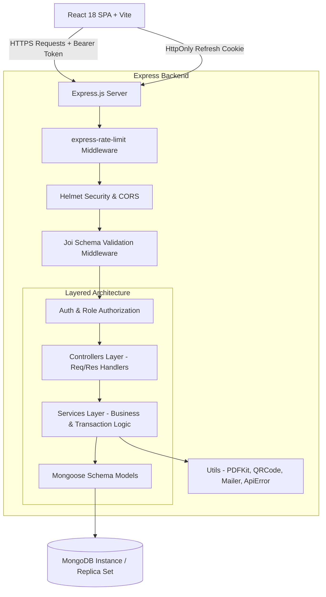
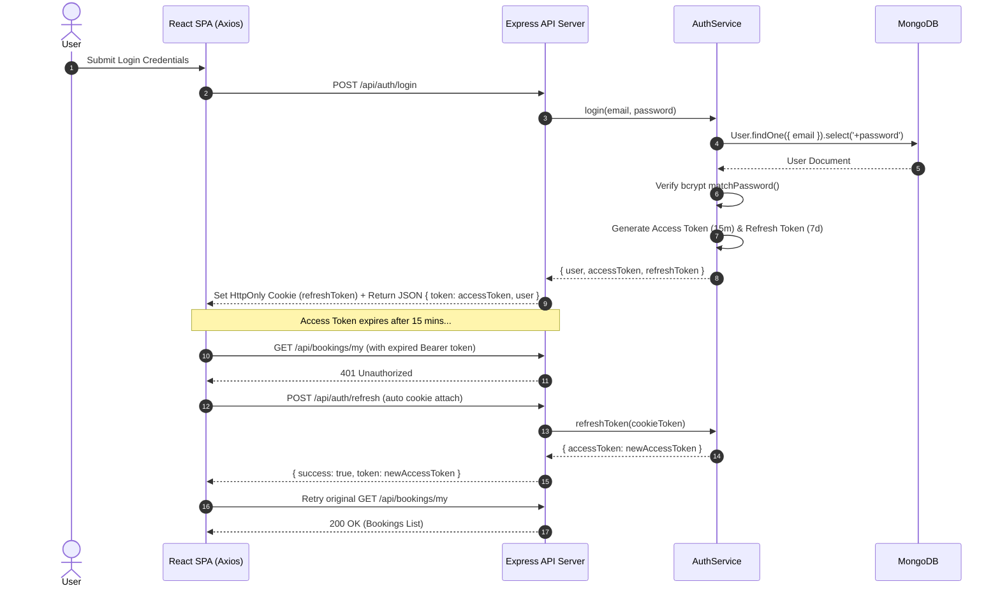
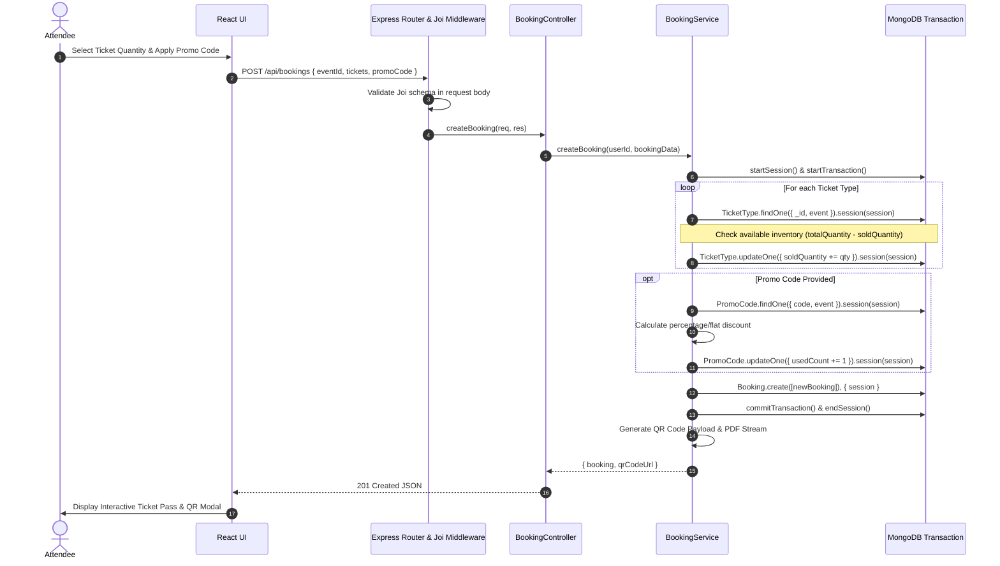
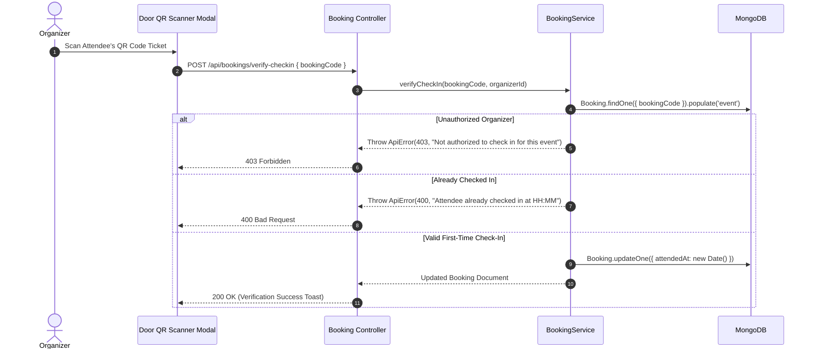

# Atomic Ops System Architecture & Sequence Workflows

This document outlines the architectural blueprints, layer boundaries, and end-to-end event sequence workflows for the Atomic Ops Event Booking Engine.

---

## 1. System Overview & Layer Architecture

---

## 2. Dual-Token Authentication Flow

---

## 3. High-Concurrency Atomic Booking Sequence

---

## 4. Door Check-In Verification Workflow

